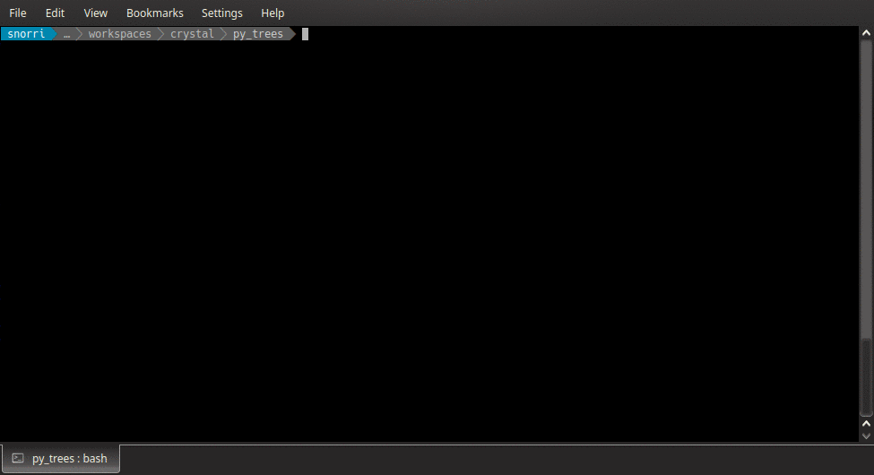
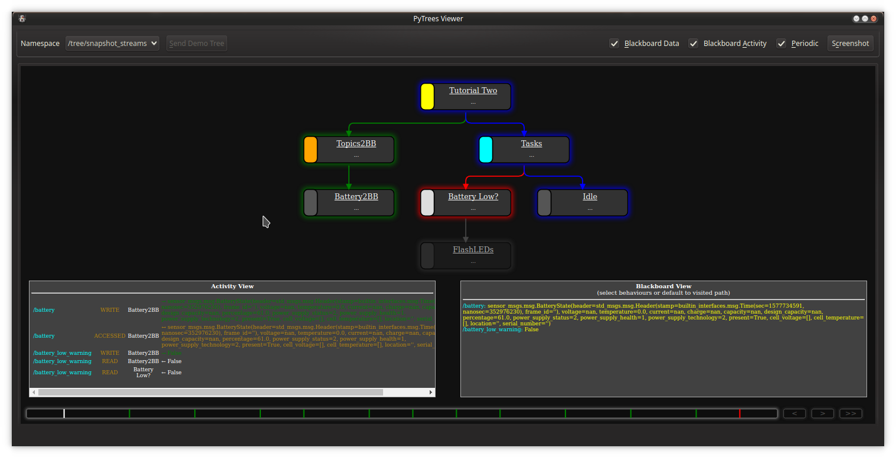

.. _tutorials-section:

Tutorials
=========

Before We Start
---------------

So, you would like your robot to actually do something non-trivial?

**Trivial?** Ah, a sequence of timed actions - move forward 3s,
rotate 90 degrees, move forward 3s, emit a greeting. This is open-loop
and can be pre-programmed in a single script easily.
Trivial. Shift gears!

**Non-Trivial?** Hmm, you'd like to dynamically plan navigational
routes (waypoints), choose between actions depending on whether
blocking obstacles are sensed, interrupt the current action
if the battery is low ... and this is just getting started.
In short, *decision making* with *priority interrupts* and 
*closed loops* with peripheral systems (e.g. via sensing,
HMI devices, web services). Now you're talking!

Most roboticists will start scripting, but
quickly run into a complexity barrier. They'll often then reach for
state machines which are great for control systems, but run into
yet another complexity barrier attempting to handle priority interrupts
and an exponentially increasing profusion of wires between states. Which
brings you here, to behavour trees! Before we proceed though...

**Where is the Robot?** Ostensibly you'll need one, at some point.
More often than not though, it's not available or it's just
not practical for rapid application development.
Might be it's only partially assembled, or new
features are being developed in parallel (deadlines!). On the other hand,
it may be available, but you cannot get enough time-share on the robot or
it is not yet stable, resulting in a stream of unrelated issues lower down
in the robotic stack that impede application development. So you make
the sensible decision of moving to simulation.

**Simulation or Mocked Robots?** If you already have a robot simulation,
it's a great place to start. In the long run though, the investment
of time to build a mock robot layer should, in most cases, pay itself off
with a faster development cycle. Why? Testing an application is mostly
about provoking and testing the many permutations and combinations o 
decision making. It's not about the 20 minutes of travel from point A to
point B in the building. With a mocked robot layer, you can emulate
that travel at ludicrous speed and provide easy handles for mocking the
problems that can arise.

So this is where the tutorials begin, with a very simple, mocked robot. They will
then proceed to build up a behaviour tree application, one step at a time. 

The Mock Robot
--------------

The tutorials here all run atop a very simple :term:`mock` robot that
encapsulates the following list of mocked components:

* Battery
* LED Strip
* Docking Action Server
* Move Base Action Server
* Rotation Action Server
* Safety Sensors Pipeline

.. note::

   It should always be possible for the :term:`mock` robot to be replaced
   by a gazebo simulated robot or the actual robot. Each
   of these underlying systems must implement exactly the same
   ROS API interface.

The tutorials take care of launching the mock robot, but it can be also
launched on its own with:

.. code-block:: bash

    $ ros2 launch py_trees_ros_tutorials mock_robot_launch.py

.. _tutorial-one:

Tutorial 1 - Data Gathering
---------------------------

.. automodule:: py_trees_ros_tutorials.one_data_gathering
    :synopsis: data gathering with the battery to blackboard behaviour

.. _tutorial-two:

Tutorial 2 - Battery Check
--------------------------

.. automodule:: py_trees_ros_tutorials.two_battery_check
    :synopsis: adding a low battery check, with LED notification to the tree

.. _tutorial-three:

Tutorial 3 - Introspect the Blackboard
--------------------------------------

About
^^^^^

Tutorial three is a repeat of :ref:`tutorial-two`. The purpose of this
tutorial however is to introduce the tools provided to
allow introspection of the blackboard from ROS. Publishers and services
are provided by :class:`py_trees_ros.blackboard.Exchange`
which is embedded in a :class:`py_trees_ros.trees.BehaviourTree`. Interaction
with the exchange is over a set of services and dynamically created topics
via the the :ref:`py-trees-blackboard-watcher` command line utility.

Running
^^^^^^^

.. code-block:: bash

    $ ros2 launch py_trees_ros_tutorials tutorial_three_introspect_the_blackboard_launch.py

In another shell:

.. code-block:: bash

    # watch the entire board
    $ py-trees-blackboard-watcher
    # watch with the recent activity log (activity stream)
    $ py-trees-blackboard-watcher --activity
    # watch variables associated with behaviours on the most recent tick's visited path
    $ py-trees-blackboard-watcher --visited
    # list variables available to watch
    $ py-trees-blackboard-watcher --list
    # watch a simple variable (slide the battery level on the dashboard to trigger a change)
    $ py-trees-blackboard-watcher /battery_low_warning
    # watch a variable with nested attributes
    $ py-trees-blackboard-watcher /battery.percentage

.. _tutorial-four:

Tutorial 4 - Introspecting the Tree
-----------------------------------

About
^^^^^

Again, this is a repeat of :ref:`tutorial-two`. In addition to services and
topics for the blackboard, the
:class:`py_trees_ros.trees.BehaviourTree` class provides services and topics
for introspection of the tree state itself as well as a command line utility,
:ref:`py-trees-tree-watcher`, to interact with these services and topics.

.. note:

    The tree watcher by default requests a hidden stream to be configured and
    opened for it's private use. On request, you can redirect the watcher to
    an already open stream (for example, the default stream which would
    typically be used for logging purposes).

.. note:

    The tip of the tree, i.e. the behaviour which redirects the decision
    making flow of the tree back to the root, is highlighted in bold.

Running
^^^^^^^

Launch the tutorial:

.. code-block:: bash

    $ ros2 launch py_trees_ros_tutorials tutorial_four_introspect_the_tree_launch.py

Using ``py-trees-tree-watcher`` on a private snapshot stream:

.. code-block:: bash

    # stream the tree state on changes
    $ py-trees-tree-watcher
    # stream the tree state on changes with statistics
    $ py-trees-tree-watcher -s
    # stream the tree state on changes with most recent blackboard activity
    $ py-trees-tree-watcher -a
    # stream the tree state on changes with visited blackboard variables
    $ py-trees-tree-watcher -b
    # serialise to a dot graph (.dot/.png/.svg) and view in xdot if available
    $ py-trees-tree-watcher --dot-graph
    # not necessary here, but if there are multiple trees to choose from
    $ py-trees-tree-watcher --namespace=/tree/snapshot_streams

Using ``py-trees-tree-watcher`` on the default snapshot stream (``~/snapshots``):

.. code-block:: bash

    # enable the default snapshot stream
    $ ros2 param set /tree default_snapshot_stream True
    $ ros2 param set /tree default_snapshot_blackboard_data True
    $ ros2 param set /tree default_snapshot_blackboard_activity True
    # connect to the stream
    $ py-trees-tree-watcher -a -s -b /tree/snapshots 

Using `py_trees_ros_viewer`_ to configure and visualise the stream:

.. code-block:: bash

    # install
    $ sudo apt install ros-<rosdistro>-py-trees-ros-viewer
    # start the viewer
    $ py-trees-tree-viewer

.. _py_trees_ros_viewer: https://github.com/splintered-reality/py_trees_ros_viewer

.. _tutorial-five:

Tutorial 5 - Action Clients
---------------------------

.. automodule:: py_trees_ros_tutorials.five_action_clients
    :synopsis: prioritised work, action_clients and preemptions

.. _tutorial-six:

Tutorial 6 - Context Switching
------------------------------

.. automodule:: py_trees_ros_tutorials.six_context_switching
    :synopsis: switching the context while scanning

.. _tutorial-seven:

Tutorial 7 - Docking, Cancelling, Failing
-----------------------------------------

.. automodule:: py_trees_ros_tutorials.seven_docking_cancelling_failing
    :synopsis: docking, cancelling and failing

Tutorial 8 - Dynamic Application Loading
----------------------------------------

.. automodule:: py_trees_ros_tutorials.eight_dynamic_application_loading
    :synopsis: dynamically inserting/pruning application subtrees

Tutorial 9 - Bagging Trees
--------------------------

Coming soon...